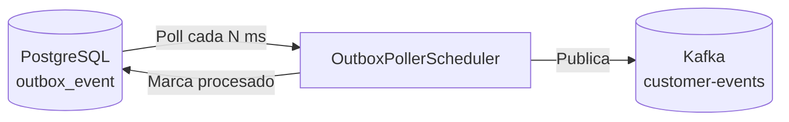

# worker

Componente responsable de la implementación del patrón **Outbox** para garantizar la entrega confiable de eventos a Kafka. Consulta periódicamente la tabla `outbox_event` en PostgreSQL y publica los eventos pendientes al topic correspondiente.

## Responsabilidades

- Polling periódico de eventos no procesados en la tabla `outbox_event`
- Publicación de eventos al topic de Kafka configurado
- Marcado de eventos como procesados tras publicación exitosa
- Manejo resiliente de errores con reintento automático en el siguiente ciclo

## Diagrama de flujo



## Cómo ejecutar el proyecto

### Prerrequisitos

| Herramienta | Versión mínima   |
|-------------|------------------|
| Java        | 17               |
| Gradle      | Wrapper incluido |
| PostgreSQL  | 13+              |
| Kafka       | 3.x+             |

> **Nota:** El worker requiere que la base de datos y Kafka estén disponibles. Se recomienda levantar la infraestructura con Docker Compose.

### 1. Configurar `application.properties`

Edita `src/main/resources/application.properties` con tus credenciales:

```properties
spring.application.name=worker

spring.datasource.url=jdbc:postgresql://localhost:5432/ms_account_db
spring.datasource.username=tu_usuario
spring.datasource.password=tu_contrasena
spring.datasource.driver-class-name=org.postgresql.Driver

spring.jpa.hibernate.ddl-auto=validate
spring.jpa.show-sql=false

spring.kafka.bootstrap-servers=localhost:9092

kafka.topics.customer-events=customer-events

outbox.poll.interval-ms=5000
```

### 2. Compilar el proyecto

> **Nota:** Este proyecto usa **Gradle Groovy DSL** (`build.gradle`). Requiere Gradle Wrapper incluido; no es necesario tener Gradle instalado globalmente.

```bash
./gradlew clean build
```

### 3. Ejecutar el proyecto

```bash
./gradlew bootRun
```

### 4. Ejecutar pruebas

```bash
./gradlew test
```

### 5. Calidad de código

```bash
# Análisis completo (tests + checkstyle + PMD + JaCoCo)
./gradlew clean test checkstyleMain pmdMain jacocoTestReport

# Ver reporte de cobertura
open build/reports/jacoco/html/index.html

# Ver reporte Checkstyle
open build/reports/checkstyle/main.html

# Ver reporte PMD
open build/reports/pmd/main.html
```

> Umbral mínimo de cobertura: **90%** (verificado con JaCoCo 0.8.12). Checkstyle 10.21.4 y PMD 7.10.0 se ejecutan sobre el código fuente principal.
